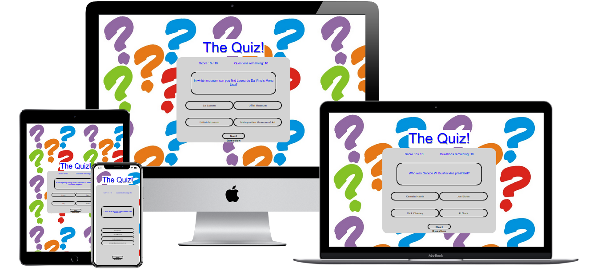
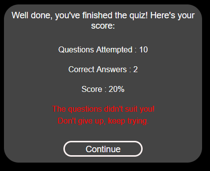

# The Quiz

The Quiz is a simple general knowledge trivia page that will allow players to test their trivia knowledge agaist a series of random questions.

When a player completes the 10 questions their total score of correct answers is converted to a percentage and a comment based on their score range is made.

## Features 

The following features are included on the webpage.  Ultimately they aim to make it easy to complete the quiz.

### Existing Features

- __Quiz Box__

  - The quiz box is the active part of the page.  It is clearly maked and stands out from the rest of the page.  the score (out of 10) and the number of questions remaining are clearly visable so that the player is fully aware of how they are doing and how many more questions they've to answer before they finish.  The selected answer is highlighted Cyan to make it obvious, the Next Question button turns yellow when it is hovered over.  When Next Question is pressed, if the selected answer is correct the button will turn green for one second, the Score will increase by 1 point, the Questions remaining will decrease by 1 point, and the next question will load.  If the selected answer is wrong, the button will turn red and the button of the correct answer will turn green, the Score will remain the same and the Questions remaining will decrease by 1 point.  This will continue until all 10 have been asked.  After the 10th question, the Completion Box (below) will load.

  - If no answer is selected and the Next Question button is pressed the player will get a dialog box asking them to pick an option:

  

- __Completion Box__

  - On completing the quiz a summary box will appear giving a final score and a comment.  There are three versions, depending on the score range the player achieves.

### Features Left to Implement

- A larger selection of questions can be added to the question bank.
- The quiz can be split with different quiz themes (e.g. Movies, Sport etc.) on each page drawing from different question banks to be selected by the player.

## Testing 

All features and links on the website were tested manually and were successful. They were tested by the developer, and by an independent third party developer, and by two non-technical users with now development experience.

The website was tested for responsiveness both manually on different sized screens and with developer tools (Inspect Element). Various browsers (Safari, Firefox, Chrome, Brave, and Edge) and Operating Sytems (Mac OS, iOS, iPad OS, and Windows 11)were used as well.  All pages and features worked well.

Initially the quiz box was not populating with questions and answers.  This was due to a missing function.  The function name had been created, but the actual function had not.  This was rectified, and the quiz box populated with the intial question and answer selection as expected.

Another error arose in that when the selection was made, the program sould not check the answer and move on.  This was due to a change in formatting that had been implemented after the project started to refer to the index number of the answers to check for the correct one.  To rectify this error, the original methodology was returned to which did not rely on indices but instead relied on simple strings to compare the given answer to the correct one.

A final error was discovered when some questions caused the quiz to stop working.  This was due to capital letter being used in the html code that was lower case in the JavaScript code.  The html code was corrected to rectify this.

One error was returned when passing through the official W3C validator. Using the html code to set the background image was deemed obsolete and it recommended using css code instead. This was done last.

Most issues were dealt with via trial and error.  There were no major bugs apart from those mentioned above as the quiz is not overly complicated.

### Validator Testing 

- HTML
  - No errors were returned when passing through the official [W3C validator](https://validator.w3.org/nu/?doc=https%3A%2F%2Fjohnmbyrne.github.io%2Fthe_quiz%2F).
- CSS
  - No errors were found when passing through the official CSS [(Jigsaw) validator](https://jigsaw.w3.org/css-validator/validator?uri=https%3A%2F%2Fjohnmbyrne.github.io%2Fthe_quiz%2F&profile=css3svg&usermedium=all&warning=1&vextwarning=&lang=en).
- JavaScript
  - No issues were found when passed through the [JSHint website](https://jshint.com/).
- Accessibility
  - The page received a 100% score on [Web Accessibility](https://www.webaccessibility.com/)
    

### Unfixed Bugs

Apart from those mentioned above, there are no other unfixed bugs. One of the shortcoming of using Bootstrap and AOS is that they use libraries that I cannot see, so outside of the specific changes I made it is difficult to find the issues quickly. 

## Deployment

- The site was deployed to GitHub pages. The steps to deploy are as follows: 
  - In the GitHub repository, navigate to the Settings tab 
  - From the source section drop-down menu, select the Master Branch
  - Once the master branch has been selected, the page will be automatically refreshed with a detailed ribbon display to indicate the successful deployment. 

The live link can be found here - https://johnmbyrne.github.io/the_quiz/ 

## Credits 

- Code Institute coding course, and the Love Maths walkthrough helped considerably in joining up all the code elements.
- Akshat Garg mentor gave good feedback and advise to get the project going.
- The general idea for the quiz came from [The Journal](https://www.thejournal.ie/gender-equality-4-5669124-Feb2022/). This is an example quiz, they are frequently done.  This was combined with the Love Maths layout to remove the need for the player to have to scroll down through the quiz.

### Content 

- The Favicon Quiz icons was created by Freepik - [Flaticons](https://www.flaticon.com/free-icons/quiz)
- The backfround image was taken from [The Shakespeare Hospice](https://www.theshakespearehospice.org.uk/Content/uploads/images/Quiz.jpg)
- The questions were provided by [Quiz Trivia Games](https://www.quiztriviagames.com/multiple-choice-trivia-questions/)
- The code on all three pages (html, css, and JavaScript) was formated by [Web Formatter](https://webformatter.com/)